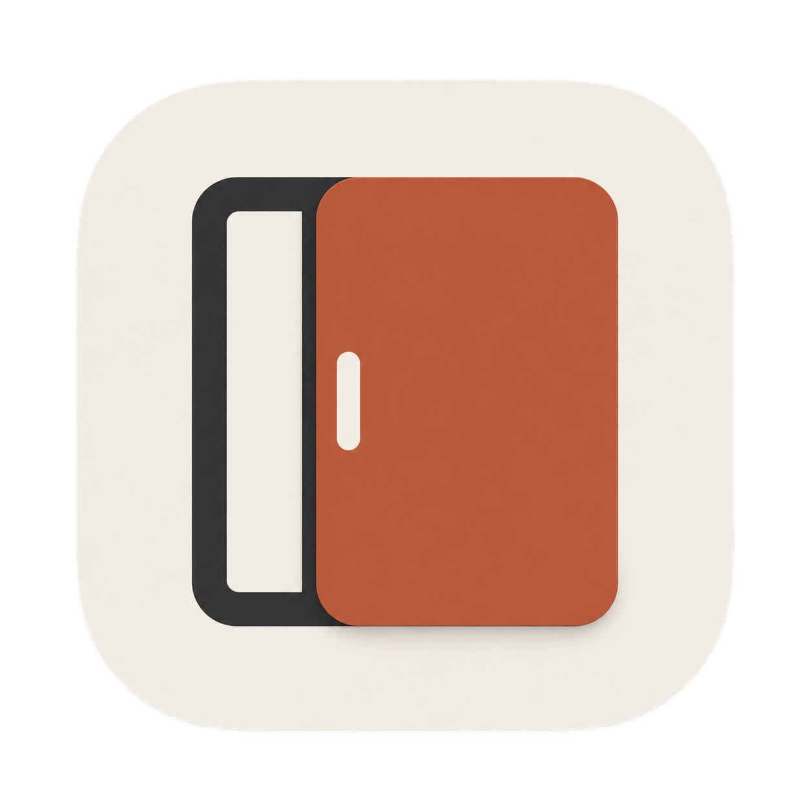
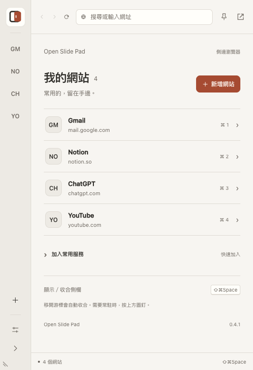
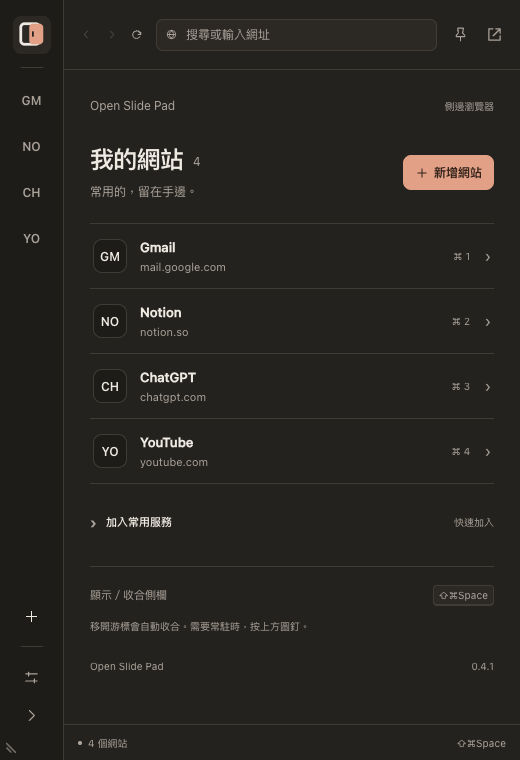

# Open Slide Pad

以 Rust 製作的 macOS 側邊瀏覽器，參考 [Slidepad](https://slidepad.app/) 的操作概念，採獨立介面與實作。網站使用 macOS 原生 **WKWebView**；視窗、狀態、快捷鍵與保存由 Rust 管理。HTML/CSS/JavaScript 僅用於本機控制面板，不需要 Node.js。



 

暖灰與陶土色介面，跟隨 macOS 明暗外觀。首頁直接開啟已加入的網站；設計決策、圖示原稿與重建方式見 [視覺設計](docs/design.md)，[原生視窗實際畫面](docs/preview.png)。

## 執行

需求：macOS 13+、Rust 1.88+、Xcode Command Line Tools。實測機器為 Apple Silicon／macOS 15.6.1；Intel 尚未實測。

```sh
cargo run --locked
# 建置可直接開啟的 app
./scripts/bundle.sh
open "dist/Open Slide Pad.app"
```

可將 `dist/Open Slide Pad.app` 拖進「應用程式」。產物為本機 ad-hoc 簽章，未做 Apple Developer ID 公證；未發行至 App Store。

## 操作

- 介面預設 **English**；在 **Settings → Language** 可切換 **繁體中文**，立即更新首頁、設定、提示與原生選單，重新啟動後保留選擇。既有設定尚未選過語言時也使用英文；網站內容由各網站自行決定語言。
- 游標停在螢幕右緣約 0.18 秒，側欄淡入滑出。設定可改為左側。系統開啟「減少動態效果」時只淡入淡出、不滑動。碰觸邊緣滑出時只顯示面板，不會搶走目前 App 的鍵盤焦點；點進面板後才接收鍵盤輸入。
- 游標離開面板約 0.65 秒後自動收合；圖釘可固定顯示。由邊緣滑出時，游標停在螢幕邊緣也算在面板內。以快捷鍵或選單列開啟時，游標要先進入面板再離開才會收合，這時螢幕邊緣不算面板內。
- 預設 **⌘⇧Space** 可顯示／收合；選單列圖示按左鍵同樣是顯示／收合，按右鍵開啟選單（含結束）。
- 在 **設定 → 顯示／收合快捷鍵** 點一下錄製欄再按下新的組合鍵，或自行選擇修飾鍵與主鍵，按「套用快捷鍵」即可立即更換，下次啟動也會保留。錄製只填入表單，不會直接套用；⌘T、⌘W 這類 App 選單快捷鍵會先被選單攔下，請改用下方的選項。「恢復預設」會改回 **⌘⇧Space**。
- 快捷鍵支援 A–Z、0–9、空白鍵、F1–F20，至少包含 ⌘、⌥、⌃ 之一。App／文字編輯的既有快捷鍵會保留；系統回報組合已占用時，保留原快捷鍵並顯示錯誤。若啟動時註冊失敗，可用選單列開啟設定再換一組；部分系統保留組合不一定會回報衝突，請避免使用 macOS 既有快捷鍵。
- 首頁列出已加入的網站與網域，按任一列即可開啟；「加入常用服務」可展開快速新增建議。
- **＋** 新增網站或搜尋；左側切換網站，各網站的 WebView 保持在記憶體中，初次選取才載入，最多 20 個。
- 網址列、上一頁、下一頁、重新整理及「在預設瀏覽器開啟」。載入時工具列下緣顯示進度，「重新整理」會變成「停止」（**⌘.**）。新開的網站或網址列輸入的網址連不上時，顯示錯誤畫面與「重試」，不會停在空白頁；原本的頁面還在時（例如在網址列打錯網址），另有「回到原本的頁面」；網頁的處理程序被系統終止時也一樣。網頁內點連結失敗、下載、被擋下的外部連結則維持原頁面，不顯示錯誤畫面。
- 網址列可直接輸入 `localhost:3000`、`example.com:8080` 這類「主機:埠」；`localhost` 與 `127.0.0.1` 預設走 http，其餘走 https。以 `scheme://` 開頭的輸入視為網址，格式錯誤會顯示錯誤訊息；其餘含空白的輸入一律當成搜尋（例如 `site:github.com wry`、`how to parse https://example.com`）。單一名稱的內網主機（如 `nas:5000`、`myhost/index.html`）不會被當成網址，請自行加上 `http://`。編碼後超過 8192 位元組的網址或搜尋會被拒絕。
- 設定可調整左右位置、360–960 pt 寬度、hot edge、釘選及移除網站。
- 用滑鼠拖曳視窗邊緣，或拖曳**內側下角的斜線把手**調整寬高（右側側欄在左下角，左側側欄在右下角）。拖曳期間暫停自動收合；放開後保存尺寸與頂端位置，網頁會同步縮放。
- 高度最小 320 pt，尺寸會限制在目前螢幕可用範圍內；設定的「恢復全高」可回到隨螢幕高度展開。保存失敗會回復拖曳前的尺寸。
- 原生快捷鍵在網站聚焦時也可用：**⌘L** 選取網址、**⌘T** 新增、**⌘R** 重新整理、**⌘.** 停止載入、**⌘[／⌘]** 返回／前進、**⌘1–9** 切換前九個網站、**⌘,** 開啟設定、**⌘W** 收合。碰觸邊緣滑出後要先點一下面板，這些快捷鍵才會作用；全域的顯示／收合快捷鍵不受影響。
- 設定中的「編輯」可重新命名，**↑／↓** 可調整網站順序，重啟後保留。
- 移除網站後，底部的「復原移除」可恢復最近一次移除的捷徑。此紀錄僅保留於本次執行；不恢復原網站尚未提交的輸入內容。
- **Esc** 在本機控制面板聚焦時關閉面板／收合；網站內 Esc 由網站處理。
- 關閉視窗只會收合；選單列「結束 Open Slide Pad」才會退出。

## 資料與信任邊界

更名後沿用既有資料識別碼與 WebKit 設定，讓網站、快捷鍵、視窗偏好及網站資料持續使用。`directories::ProjectDirs` 將設定放在 `~/Library/Application Support/app.sliderust.SlideRust/`。設定是 version 1 的 `settings.json`，以同目錄暫存檔＋原子 rename 保存。檔案鎖阻止同一資料目錄的第二個程序覆寫設定。設定損毀、過大或版本不支援時會詢問：結束（原檔不動），或把原檔改名為 `settings.json.broken-<時間戳>` 備份後以預設值啟動；只改名，不覆寫也不刪除任何檔案，網站登入資料不受影響。最多讀取 256 KiB。原子替換前寫入失敗不變更畫面狀態；替換成功但目錄同步失敗時，畫面採用已寫入的新設定，並顯示耐久性警告。唯一例外是選取的網站：它屬於 UI 狀態，切換立即生效，保存失敗只顯示提示，之後任何一次成功保存都會一併寫入。

`language` 支援 `en` 與 `zh-TW`；省略時為英文，英文保存時也省略此欄位。繁中設定含新增欄位，若回退至 0.4.1 或更舊版本，請先切回英文或還原升級前備份。0.4.3 起會把設定檔頂層不認得的欄位原樣保留並寫回（這些欄位不會送進控制面板），因此日後新增獨立欄位不需要提升 `version`，`version` 只在破壞性變更時提升；0.4.2 與更舊版本仍會拒絕不認得的欄位。翻譯集中於 `ui/locales/en.json`，繁中字串作為原文鍵，Rust 與本機 UI 共用同一份目錄。

網站登入與 cookies 交由此 app 的 WebKit 預設資料存放區管理，與 Safari 的登入分開。所有網站共用同一個 profile；移除捷徑不清除網站資料。網址列明確提交的網址會保存；頁面自動導向與 OAuth URL 不寫回設定。

遠端 WebView 沒有控制 IPC，也不注入腳本；載入失敗是由 App 輪詢 WKWebView 的載入狀態推斷，不是由網頁回報。遠端 WebView 送出與 Safari 相同格式的 User-Agent（`… Version/<版本> Safari/605.1.15`），版本讀自本機 `/Applications/Safari.app`，讀不到，或內容不是以點分隔的數字，就用內建版本；WKWebView 預設的 UA 沒有這兩段，會被部分網站當成不支援的瀏覽器。控制面板不允許遠端導覽、iframe 或網路請求，所有網站標題以文字呈現。僅支援 HTTP/HTTPS；不執行 `file:`、`javascript:` 或外部 app scheme。網站內嵌的 iframe 另可使用 `about:blank`（可帶 query 與 fragment）、`about:srcdoc`（依 HTML 規範只能帶 fragment）與來源為 HTTP/HTTPS 的 `blob:` 文件，這些都屬於原網站來源；`data:` 文件一律拒絕；任何含空白、控制字元或超過 8192 位元組的位址也一律拒絕。網站自行導向空白頁時，網址列會維持前一個網址。

## 驗證

```sh
# fmt、clippy、單元測試與 UI 回歸腳本；GitHub Actions 跑同一支腳本
./scripts/verify.sh
# 另跑原生 smoke：需要視窗伺服器與網路，使用獨立暫存目錄與無痕 WebKit，最長約 25 秒
./scripts/verify.sh --smoke
```

CI 固定使用 Rust 1.98.1：clippy 每版都會新增 lint，浮動版本會讓未改動的程式碼突然變紅；升級時請同步修改 `.github/workflows/ci.yml`。

smoke 驗證原生視窗、本機控制 IPC、example.com 載入、遠端網頁看到的 User-Agent、內嵌 iframe 放行規則（`srcdoc` 與 `blob:` 載入、`data:` 被擋）、同文件 pushState，以及原生選單 ⌘L／⌘T／⌘W 的命令路由、原生 responder、DOM 焦點與收合。測試直接呼叫 app 內的 AppKit 選單契約，不送出系統鍵盤輸入。另驗證快捷鍵設定表單 IPC、原生 F18／F19 組合來回註冊、即時保存、過期快捷鍵 ID 過濾與畫面提示同步。另驗證英文預設、雙語設定 IPC、選單同步、語言保存失敗回復，以及切換時保留網站與其他偏好。亦驗證原生視窗 resize 事件、網頁尺寸、尺寸保存、唯讀目錄下回復與恢復全高，以及網站選取的保存政策（已選同一站不寫檔、保存失敗仍切換）。最後新增一個連不上的本機網址（`http://127.0.0.1:1/`），確認出現錯誤畫面、原生網頁視圖讓位、「重試」重新載入，以及切回正常網站後恢復；再從已載入的網站用網址列導覽到同一個連不上的網址、重試一次，確認「回到原本的頁面」能跳過失敗留下的空白頁回到原頁面。它不是完整 UI E2E，不送出實際滑鼠拖曳，不會登入帳號或提交外部表單。

快捷鍵負向測試包含註冊衝突、保存失敗回復、提交後同步警告與解除失敗警告。`node scripts/test-shortcut-ui.cjs` 可重跑快捷鍵重設與錄製、左右位置切換、提示的關閉與暫停倒數、載入進度／停止／失敗畫面、尺寸控制命令與首頁網站清單的回歸測試，並檢查雙語切換、保存回覆前維持原語言、版本字串代入，以及 UI 與 Rust 兩端訊息的翻譯目錄完整性。

## 目前邊界

尚無 iCloud、Safari 擴充、MCP、多帳號 profile、下載管理、通知、登入時啟動及自動更新。`target=_blank`／新視窗要求會在原網站分頁開啟；需要 popup opener 的 OAuth 流程可能不相容，請使用「在預設瀏覽器開啟」。攝影機／麥克風流程未支援。所有網站的登入相容性、全螢幕 Spaces、實體多螢幕與 Intel 機器尚未全面驗證。

研究、取捨與來源見 [docs/research.md](docs/research.md)，負向驗收見 [docs/security-tests.md](docs/security-tests.md)。
